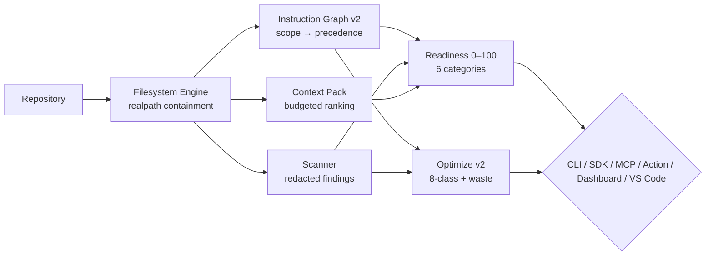

# ACKit — AgentContextKit

<p align="center">
  <a href="https://www.npmjs.com/package/@cynrath/agent-context-kit"></a>
  <a href="https://www.npmjs.com/package/@cynrath/agent-context-kit"></a>
  <a href="https://github.com/Cynrath/agent-context-kit"></a>
  <a href="https://github.com/Cynrath/agent-context-kit/actions/workflows/ci.yml"></a>
</p>

<p align="center">
  <a href="https://opensource.org/licenses/MIT"></a>
  <a href="https://github.com/Cynrath/agent-context-kit/releases/tag/v0.2.0"></a>
  <a href="https://www.npmjs.com/package/@cynrath/agent-context-kit"></a>
  
  
</p>

<h3 align="center">Turn any repository into an <em>agent-ready</em> repository.</h3>
<p align="center">Instruction graph · Skills · Scanning · Context packs · Tasks · Policy · Readiness · MCP<br><strong>Offline-first · Deterministic · Task-first</strong> — <code>ackit</code> on Node&nbsp;≥&nbsp;22</p>

<p align="center">
  <a href="#quickstart"><strong>Quickstart →</strong></a> ·
  <a href="docs/guides/getting-started.md">Getting Started</a> ·
  <a href="CHANGELOG.md">Changelog</a> ·
  <a href="docs/security/THREAT_MODEL.md">Security</a> ·
  <a href="#-github-action">GitHub Action</a>
</p>

---

### ✨ Demo (30 seconds)

```bash
# 1 — onboard (dry-run, writes nothing)
$ ackit init --dry-run
✔ plan: AGENTS.md shim + 4 built-in skills

# 2 — score readiness (explainable, no LLM)
$ ackit readiness
Readiness 88/100 ██████████████████░░  (threshold 80 — pass)
  Instructions        90/100
  Security            90/100
  Context Efficiency  70/100

# 3 — graph + optimize
$ ackit instructions --explain
codex/AGENTS.md → claude/CLAUDE.md (provenance: frontmatter applyTo)

$ ackit optimize --explain --json | jq .suggestions[0].tokenWasteEstimate
42

# 4 — provider-aware pack & dashboard
$ ackit pack --profile codex --max-tokens 50000 | head -5
# ACKit Context Pack — 12 files, 34210 tokens

$ ackit dashboard --port 0 --open   # localhost-only, CSP, live polling
→ http://127.0.0.1:54321
```

---

### 🧭 Table of Contents

- [Why ACKit?](#-why)
- [Features at a glance](#-features-at-a-glance)
- [Install](#-install)
- [Quickstart](#-quickstart)
- [CLI Overview](#-cli-overview)
- [Configuration](#-configuration)
- [Architecture](#-architecture)
- [GitHub Action](#-github-action)
- [VS Code](#-vs-code)
- [Docs](#-docs)
- [Development](#-development)
- [Versioning](#-versioning)

---

### ❓ Why

| Before | With ACKit |
|---|---|
| Convention-based — nothing is verified | **Deterministic local analysis** with stable JSON/SARIF contracts |
| Cloud-coupled — code leaves the machine | **Offline-by-construction** — zero network in product code |
| Secrets leak into prompts/logs | **Redacted at construction** — evidence never contains plaintext secrets |
| One `AGENTS.md` for all providers | **Provider-aware** — Codex/Claude/Copilot/Gemini/generic, `includeScopes`/`applyTo` |
| “It worked on my machine” | **Machine-checkable gates** — `ackit scan --ci`, `ackit readiness --strict` |

> This repository dogfoods itself: it was built by following the same `docs/tasks` task system it ships.

---

### 🎁 Features at a glance

| | Capability | Command | What you get |
|---|---|---|---|
| 📊 | **Agent Readiness** | `ackit readiness` | 0–100 across 6 categories (25/25/20/10/10/10), weighted renormalization, `ackit.readiness.v1` JSON + terminal tree, `--fail-below/--strict/--baseline/--compare`, N/A handling |
| 🧩 | **Instruction Graph v2** | `ackit instructions --explain` | Codex/Claude/Gemini/Copilot+shared, nesting, `includeScopes`/`excludeScopes`/`providerApplicability`/`provenance`/`shadowedBy`/`duplicateOf`, `applyTo` globs, conflict/duplicate/shadow/dead, `depth→precedence→id`, symlink `realpath`, `maxNodes`/`maxDepth` |
| 🎭 | **Provider Profiles** | `ackit pack --profile codex` | 5 built-ins (`codex`/`claude`/`copilot`/`gemini`/`generic`), `CLI --profile > ackit.yml > auto-detect > generic`, budget/`includePriority`/`fileConventions` |
| 📜 | **Rule/Policy Packs** | `ackit policy check` | `schemas/rule-pack.schema.json` v1 (`presence|pattern|config|dependency|instruction`), `glob`/`scope`/`match`, `overrides`/`composition`, local + `node_modules` package-dist only, `POL-PACK-COLLISION`, ReDoS/size guards |
| 🧹 | **Optimize v2** | `ackit optimize --explain` | 8-class taxonomy, `evidence[]`/`confidence`/`tokenWasteEstimate`/`provenance`/`plan {target,action,diff}`, `--fix --dry-run` on managed surfaces, `terminal|json|markdown|sarif` |
| 📦 | **Context Packs** | `ackit pack --max-tokens 50000` | Weighted deterministic ranking, manifest `hash/reason/tokens` per file, `<local-path>` scrubbing |
| 🔒 | **Scanning** | `ackit scan --ci` | Secrets/assignments/private keys/connection strings/entropy/absolute-path/CI pinning/drift, redacted evidence, SARIF 2.1.0, baselines, incremental `changed/staged/since/range`, cache |
| ✅ | **Tasks** | `ackit task` | `docs/tasks` single-active, `[ ]/[~]/[x]/[!]`, completion gate, `task doctor` |
| 🔭 | **Watch/Dashboard** | `ackit dashboard` | `scan --watch` debounced 400ms + cache + `SIGINT`→`WatchHandle.done`; `dashboard` localhost-only `127.0.0.1`, `--allow-nonlocal` required, `CSP default-src 'self'` + `nosniff`, XSS-escaped, `/api/*` paginated, polling, `<50KB` vanilla JS |
| 🩺 | **Diagnostics** | `ackit diagnostics bundle` | `ackit.diagnostics.v1` + deterministic `bundle-manifest.json` (`sha256` + redaction count), 5-secret `[REDACTED]` proof |
| ⚡ | **Benchmarks** | `benchmarks/run.mjs` | 7 deterministic fixtures, 8 metrics (`coldScanMs`/`warmScanMs`/`incrementalMs`/`peakRssMb`/`filesPerSec`/`packMs`/`graphMs`/`cacheHitRatio`), median-of-3, `1.5×` thresholds |
| 🔌 | **SDK v1** | `import { scanRepository } from "@cynrath/agent-context-kit"` | `sideEffects:false`, `type:module`, `exports {".","./mcp"}`, `AbortSignal` <200ms, `AckitError` (`code`+`remediation`), `examples/sdk-consumer.mjs` |
| 🧩 | **VS Code** | `extensions/vscode` | `0.2.0`, `cynrath`, `lints` Linters, `onStartupFinished`, readiness tree + Problems `ACKITxxx` + “instructions for current file” + palette, watcher, no telemetry, `<2MB` VSIX — **VSIX-ready, not yet Marketplace** |
| 🤖 | **MCP** | `ackit mcp serve` | Official SDK stdio, 9 read-only tools, 5 resources, 4 prompts, `InMemoryTransport` cancellation |

---

### 📦 Install

**Requires Node ≥ 22.**

```bash
# global (recommended)
npm install --global @cynrath/agent-context-kit
ackit --version  # 0.2.0

# one-shot, pinned
npx --yes @cynrath/agent-context-kit@0.2.0 --version
npx --yes @cynrath/agent-context-kit@0.2.0 --help

# from source
pnpm install --frozen-lockfile && pnpm build
node dist/cli/index.js --help
```

---

### 🚀 Quickstart

```bash
ackit init --dry-run        # plan shims + 4 built-in skills (writes nothing)
ackit scan --ci             # gate: exit 1 at/over threshold (medium)
ackit readiness             # 0–100, N/A renormalization, --strict/--fail-below
ackit instructions --explain # graph v2 with provenance
ackit optimize --explain    # 8-class advisor, waste estimates
ackit pack --profile codex --max-tokens 50000  # provider-aware, budgeted
ackit diagnostics --json | jq .profile
ackit dashboard --port 0 --open  # localhost-only
```

> Every command supports `--json` and `--help`. Full tour → [`docs/guides/getting-started.md`](docs/guides/getting-started.md)

---

### 🖥️ CLI Overview

| Command | Purpose | Highlights |
|---|---|---|
| `init` | plan/write shims + skills | `--dry-run`, `--agents` |
| `scan` | security/hygiene scan | `--ci --changed --staged --since --range --baseline --write-baseline --watch --format --fail-below/--strict/--compare` |
| `readiness` | **0–100 scoring** | `--fail-below --strict --baseline/--compare --json` |
| `optimize` | hygiene advisor **v2** | `--fix --dry-run --profile --explain --category --min-severity --format terminal\|json\|markdown\|sarif --diff` |
| `diagnostics` | env/config/cache/policy/tasks | `--json`, `bundle --out/--redact-check --profile` |
| `dashboard` | **local dashboard** (localhost-only) | `--host/--port/--allow-nonlocal --open` |
| `instructions` | graph **v2** tree/JSON + effective chain | `--provider --profile --for --explain --json` |
| `pack` | **provider-aware** pack | `--max-tokens --profile --include --changed --format` |
| `skills` | list / validate / install |  |
| `task` | `create/list/start/complete/archive/doctor` | docs-first, single-active |
| `policy` / `config` | offline policy / config check |  |
| `cache` / `workspaces` / `hooks` / `report serve` / `mcp serve` | utilities |  |

Details: [`docs/reference/cli.md`](docs/reference/cli.md) · Exit codes: [`docs/reference/exit-codes.md`](docs/reference/exit-codes.md) · Schemas: [`docs/reference/schemas.md`](docs/reference/schemas.md)

<details><summary><strong>Exit codes</strong></summary>

0 ok · 1 threshold/new-findings · 2 usage/config · 3 environment · 4 security boundary · 5 internal. See [`docs/reference/exit-codes.md`](docs/reference/exit-codes.md).

</details>

---

### ⚙️ Configuration

Optional root `ackit.yml` (strict, additive — `v1` still valid):

```yaml
schemaVersion: 1
scan:
  severityThreshold: medium
limits:
  maxFiles: 50000
context:
  maxTokens: 80000
policy:
  extends: []
  rulePacks: []               # declarative packs (local or node_modules)
readiness:
  weights: { instructions: 25, security: 25, contextEfficiency: 20, taskHygiene: 10, skills: 10, policy: 10 }
  strictThreshold: 80
profile: codex                # codex|claude|copilot|gemini|generic
profiles:
  extend: []                  # repo-relative custom profiles
```

Validate: `ackit config check` · Schema: `schemas/ackit.schema.json` · Reference: [`docs/reference/config.md`](docs/reference/config.md)

---

### 🏗️ Architecture



- **Single door to filesystem** — one containment engine
- **Redaction before reporters** — findings constructed already-safe
- **Determinism** — same repo+config → byte-identical JSON/fingerprints
- **Offline-by-construction** — no network in product code

More: [`docs/architecture/overview.md`](docs/architecture/overview.md)

---

### 🤖 GitHub Action

Official `Cynrath/agent-context-kit@v0.2.0` (SHA-pinned for high-assurance):

```yaml
permissions:
  contents: read
jobs:
  ackit:
    runs-on: ubuntu-latest
    steps:
      - uses: actions/checkout@f548e57e544e1ff5a4c46bf1e1b8685f8e4a348a
      - uses: Cynrath/agent-context-kit@v0.2.0
        with:
          command: scan
          args: "--json"
          fail-threshold: high
          upload-sarif: "false"
      # optional: upload SARIF via github/codeql-action/upload-sarif@v3
      # optional: upload findings via actions/upload-artifact@v4
```

Inputs `command/args/fail-threshold/upload-sarif`, outputs `findings-json/sarif-path`, annotations/SARIF 2.1.0/job summary, least-privilege. Guide: [`docs/guides/ci.md`](docs/guides/ci.md) · Action: [`action.yml`](action.yml)

---

### 👀 Watch / Dashboard & Diagnostics

```bash
ackit scan --watch          # debounced 400ms, incremental cache, SIGINT → exit 0
ackit dashboard --port 0 --open  # localhost-only, CSP, XSS-escaped, live polling
ackit report serve ./report.html --port 0

ackit diagnostics --json | jq .profile
ackit diagnostics bundle --out ./ackit-diag.zip --redact-check
```

Guides: [`docs/guides/watch-dashboard.md`](docs/guides/watch-dashboard.md) · Reference: [`docs/reference/diagnostics.md`](docs/reference/diagnostics.md)

---

### 🔌 SDK

```js
import { scanRepository, scoreRepository, buildInstructionGraph } from "@cynrath/agent-context-kit";

const result = await scanRepository({ canonicalPath: process.cwd() });
console.log(result.findings.length);

// cancellable
const ac = new AbortController();
setTimeout(() => ac.abort(), 10);
await scanRepository({ canonicalPath: "." }, { signal: ac.signal });
```

ESM-only, `sideEffects:false`, `AbortSignal` cancellable, no `process.exit`. Reference: [`docs/reference/sdk.md`](docs/reference/sdk.md) · Example: [`examples/sdk-consumer.mjs`](examples/sdk-consumer.mjs)

---

### 🧩 VS Code

Extension is **implemented and VSIX-ready (`extensions/vscode` `0.2.0`, `<2MB`) but not yet published to Marketplace** — separate `marketplace: yes` checkpoint.

From source:

```bash
pnpm --filter vscode build
vsce package # → ackit-0.2.0.vsix
```

Features: readiness tree, Problems `ACKITxxx`, graph “instructions for current file”, tasks/policy/optimize, palette `Refresh/Show Graph/Optimize/Diagnostics`, file watcher debounced, no telemetry.

Guide: [`docs/guides/vscode.md`](docs/guides/vscode.md)

---

### 📚 Docs

| Area | Link |
|---|---|
| Architecture | [`docs/architecture/overview.md`](docs/architecture/overview.md) |
| Concepts | `instruction-graph` · `context-budget` · `provider-profiles` · `readiness` |
| Guides | [`getting-started`](docs/guides/getting-started.md) · [`readiness`](docs/guides/readiness.md) · [`optimize`](docs/guides/optimize.md) · [`provider-profiles`](docs/guides/provider-profiles.md) · [`instruction-graph`](docs/guides/instruction-graph.md) · [`rule-packs`](docs/guides/rule-packs.md) · [`ci`](docs/guides/ci.md) · [`watch-dashboard`](docs/guides/watch-dashboard.md) · [`diagnostics`](docs/guides/diagnostics.md) · [`sdk`](docs/guides/sdk.md) · [`vscode`](docs/guides/vscode.md) · [`monorepo`](docs/guides/monorepo.md) |
| Reference | `cli` · `config` · `rules` · `readiness` · `profile` · `rule-pack` · `instruction-graph` · `diagnostics` · `sdk` · `exit-codes` · `mcp` · `schemas` |
| Decisions | [`docs/decisions/`](docs/decisions/) · `v0.2.0`: [`docs/v0.2.0/`](docs/v0.2.0/) |
| Tasks | [`docs/tasks/active`](docs/tasks/active) |

---

### 🔌 MCP Setup

```json
{ "mcpServers": { "ackit": { "command": "ackit", "args": ["mcp", "serve"] } } }
```

Reference: [`docs/reference/mcp.md`](docs/reference/mcp.md)

---

### 🛠️ Requirements & Development

**Requirements:** Node ≥ 22 · pnpm 11 (development) · git optional (incremental features)

**Development:**

```bash
pnpm install --frozen-lockfile
pnpm lint && pnpm format:check && pnpm typecheck
pnpm build && pnpm test && pnpm smoke:cli
pnpm run smoke:package   # pack → temp install → CLI smoke
```

See [`CONTRIBUTING.md`](CONTRIBUTING.md) for the docs-first workflow.

---

### 🔖 Versioning

Current: **`0.2.0`** on `master` · [Changelog](CHANGELOG.md) · [Releases](https://github.com/Cynrath/agent-context-kit/releases) · `latest → 0.2.0` via OIDC Trusted Publishing with provenance. Legacy `.NET/NuGet 1.0.0-rc.1` at `258918b` is frozen.

---

### 📄 License

MIT — [`LICENSE`](LICENSE)

<p align="center">
  <a href="https://github.com/Cynrath/agent-context-kit">⭐ Star this repo if it makes your agents happier!</a>
</p>
