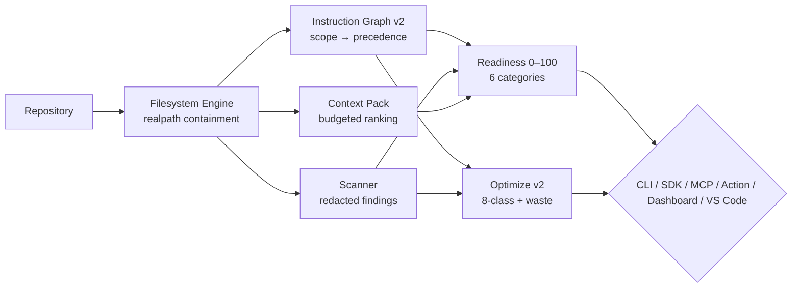

# ACKit — AgentContextKit

<p align="center">
  <a href="https://www.npmjs.com/package/@cynrath/agent-context-kit"></a>
  <a href="https://www.npmjs.com/package/@cynrath/agent-context-kit"></a>
  <a href="https://github.com/Cynrath/agent-context-kit"></a>
  <a href="https://github.com/Cynrath/agent-context-kit/actions/workflows/ci.yml"></a>
</p>

<p align="center">
  <a href="https://opensource.org/licenses/MIT"></a>
  <a href="https://github.com/Cynrath/agent-context-kit/releases/tag/v0.4.0"></a>
  <a href="https://www.npmjs.com/package/@cynrath/agent-context-kit"></a>
  
  
  <a href="https://github.com/sponsors/Cynrath"></a>
  <a href="https://github.com/Cynrath/agent-context-kit/discussions"></a>
</p>

<h3 align="center">Turn any repository into an <em>agent-ready</em> repository.</h3>
<p align="center">Instruction graph · Skills · Scanning · Context packs · Tasks · Policy · Readiness · MCP<br><strong>Offline-first · Deterministic · Task-first</strong> — <code>ackit</code> on Node&nbsp;≥&nbsp;22</p>

<p align="center">
  <a href="#quickstart"><strong>Quickstart →</strong></a> ·
  <a href="docs/guides/getting-started.md">Getting Started</a> ·
  <a href="CHANGELOG.md">Changelog</a> ·
  <a href="docs/security/THREAT_MODEL.md">Security</a> ·
  <a href="https://github.com/Cynrath/agent-context-kit/discussions">Discussions</a> ·
  <a href="https://github.com/sponsors/Cynrath">Sponsors</a> ·
  <a href="#-github-action">GitHub Action</a>
</p>

---

### ✨ Demo (30 seconds)

```bash
# 1 — onboard (dry-run, writes nothing)
$ ackit init --dry-run
✔ plan: AGENTS.md shim + 4 built-in skills

# 2 — score readiness (explainable, no LLM)
$ ackit readiness
Readiness 88/100 ██████████████████░░  (threshold 80 — pass)
  Instructions        90/100
  Security            90/100
  Context Efficiency  70/100

# 3 — graph + optimize
$ ackit instructions --explain
codex/AGENTS.md → claude/CLAUDE.md (provenance: frontmatter applyTo)

$ ackit optimize --explain --json | jq .suggestions[0].tokenWasteEstimate
42

# 4 — provider-aware pack & dashboard
$ ackit pack --profile codex --max-tokens 50000 | head -5
# ACKit Context Pack — 12 files, 34210 tokens

$ ackit dashboard --port 0 --open   # localhost-only, CSP, live polling
→ http://127.0.0.1:54321
```

---

### 🧭 Table of Contents

- [Why ACKit?](#-why)
- [Features at a glance](#-features-at-a-glance)
- [Install](#-install)
- [Quickstart](#-quickstart)
- [CLI Overview](#-cli-overview)
- [Configuration](#-configuration)
- [Architecture](#-architecture)
- [GitHub Action](#-github-action)
- [VS Code](#-vs-code)
- [Docs](#-docs)
- [Development](#-development)
- [Versioning](#-versioning)

---

### ❓ Why

| Before | With ACKit |
|---|---|
| Convention-based — nothing is verified | **Deterministic local analysis** with stable JSON/SARIF contracts |
| Cloud-coupled — code leaves the machine | **Offline-by-construction** — zero network in product code |
| Secrets leak into prompts/logs | **Redacted at construction** — evidence never contains plaintext secrets |
| One `AGENTS.md` for all providers | **Provider-aware** — Codex/Claude/Copilot/Gemini/generic, `includeScopes`/`applyTo` |
| “It worked on my machine” | **Machine-checkable gates** — `ackit scan --ci`, `ackit readiness --strict` |

> This repository dogfoods itself: it was built by following the same `docs/tasks` task system it ships.

**What ACKit is not:** an autonomous coding agent, a model runtime, a browser
automation framework, an agent router, or a cloud orchestration service. ACKit
is the deterministic, offline-first engineering layer those agents share —
repository context, explicit intent, structured tasks, plan discipline,
evidence-backed completion, resumability, independent verification, policy
enforcement, drift detection, and provider interoperability. Model execution
and autonomous coding stay with your chosen agent (Codex, Claude Code,
OpenCode, Copilot, Gemini, Cursor, Cline, any MCP-capable agent).

---

### 🎁 Features at a glance

<table style="width:100%; table-layout:fixed; border-collapse:collapse; word-break:break-word; overflow-wrap:anywhere;">
<colgroup><col style="width:40px"><col style="width:170px"><col style="width:210px"><col></colgroup>
<thead><tr><th style="border:1px solid #d0d7de; padding:8px; text-align:left;"></th><th style="border:1px solid #d0d7de; padding:8px; text-align:left;">Capability</th><th style="border:1px solid #d0d7de; padding:8px; text-align:left;">Command</th><th style="border:1px solid #d0d7de; padding:8px; text-align:left;">What you get</th></tr></thead>
<tbody>
<tr><td style="border:1px solid #d0d7de; padding:8px;">📊</td><td style="border:1px solid #d0d7de; padding:8px;"><strong>Agent Readiness</strong></td><td style="border:1px solid #d0d7de; padding:8px;"><code>ackit readiness</code></td><td style="border:1px solid #d0d7de; padding:8px;">0–100 across 6 categories (25/25/20/10/10/10), weighted renormalization, <code>ackit.readiness.v1</code> JSON + terminal tree, <code>--fail-below</code>/<code>--strict</code>/<code>--baseline</code>/<code>--compare</code></td></tr>
<tr><td style="border:1px solid #d0d7de; padding:8px;">🧩</td><td style="border:1px solid #d0d7de; padding:8px;"><strong>Instruction Graph v2</strong></td><td style="border:1px solid #d0d7de; padding:8px;"><code>ackit instructions --explain</code></td><td style="border:1px solid #d0d7de; padding:8px;">Codex/Claude/Gemini/Copilot+shared, nesting, <code>includeScopes</code>/<code>excludeScopes</code>/<code>providerApplicability</code>/<code>provenance</code>/<code>shadowedBy</code>/<code>duplicateOf</code>, <code>applyTo</code> globs, conflict/duplicate/shadow/dead, <code>depth→precedence→id</code></td></tr>
<tr><td style="border:1px solid #d0d7de; padding:8px;">🎭</td><td style="border:1px solid #d0d7de; padding:8px;"><strong>Provider Profiles</strong></td><td style="border:1px solid #d0d7de; padding:8px;"><code>ackit pack --profile codex</code></td><td style="border:1px solid #d0d7de; padding:8px;">5 built-ins (<code>codex</code>/<code>claude</code>/<code>copilot</code>/<code>gemini</code>/<code>generic</code>), <code>CLI --profile > ackit.yml > auto-detect > generic</code>, budget/<code>includePriority</code></td></tr>
<tr><td style="border:1px solid #d0d7de; padding:8px;">📜</td><td style="border:1px solid #d0d7de; padding:8px;"><strong>Rule/Policy Packs</strong></td><td style="border:1px solid #d0d7de; padding:8px;"><code>ackit policy check</code></td><td style="border:1px solid #d0d7de; padding:8px;"><code>schemas/rule-pack.schema.json</code> v1 (<code>presence|pattern|config|dependency|instruction</code>), <code>glob</code>/<code>scope</code>/<code>match</code>, <code>overrides</code>/<code>composition</code>, ReDoS/size guards</td></tr>
<tr><td style="border:1px solid #d0d7de; padding:8px;">🧹</td><td style="border:1px solid #d0d7de; padding:8px;"><strong>Optimize v2</strong></td><td style="border:1px solid #d0d7de; padding:8px;"><code>ackit optimize --explain</code></td><td style="border:1px solid #d0d7de; padding:8px;">8-class taxonomy, <code>evidence[]</code>/<code>confidence</code>/<code>tokenWasteEstimate</code>/<code>provenance</code>/<code>plan</code>, <code>--fix --dry-run</code>, <code>terminal|json|markdown|sarif</code></td></tr>
<tr><td style="border:1px solid #d0d7de; padding:8px;">📦</td><td style="border:1px solid #d0d7de; padding:8px;"><strong>Context Packs</strong></td><td style="border:1px solid #d0d7de; padding:8px;"><code>ackit pack --max-tokens 50000</code></td><td style="border:1px solid #d0d7de; padding:8px;">Weighted deterministic ranking, manifest <code>hash/reason/tokens</code> per file</td></tr>
<tr><td style="border:1px solid #d0d7de; padding:8px;">🔒</td><td style="border:1px solid #d0d7de; padding:8px;"><strong>Scanning</strong></td><td style="border:1px solid #d0d7de; padding:8px;"><code>ackit scan --ci</code></td><td style="border:1px solid #d0d7de; padding:8px;">Secrets/assignments/private keys/connection strings/entropy/absolute-path/CI pinning/drift, redacted evidence, SARIF 2.1.0</td></tr>
<tr><td style="border:1px solid #d0d7de; padding:8px;">✅</td><td style="border:1px solid #d0d7de; padding:8px;"><strong>Tasks</strong></td><td style="border:1px solid #d0d7de; padding:8px;"><code>ackit task</code></td><td style="border:1px solid #d0d7de; padding:8px;"><code>docs/tasks</code> single-active, <code>[ ]/[~]/[x]/[!]</code>, completion gate, <code>task doctor</code></td></tr>
<tr><td style="border:1px solid #d0d7de; padding:8px;">🧭</td><td style="border:1px solid #d0d7de; padding:8px;"><strong>Workflows + Intent</strong></td><td style="border:1px solid #d0d7de; padding:8px;"><code>ackit workflow set --profile standard</code></td><td style="border:1px solid #d0d7de; padding:8px;">quick/standard/high-risk lifecycles with stage gates (<code>ackit.workflow.v1</code>), committed intent docs with fingerprints (<code>ackit.intent.v1</code>), artifact refs on tasks</td></tr>
<tr><td style="border:1px solid #d0d7de; padding:8px;">🧾</td><td style="border:1px solid #d0d7de; padding:8px;"><strong>Evidence + Verification</strong></td><td style="border:1px solid #d0d7de; padding:8px;"><code>ackit evidence verify … && ackit verification record …</code></td><td style="border:1px solid #d0d7de; padding:8px;">criteria↔proof registry (<code>ackit.evidence.v2</code>), bounded verification bundles for fresh verifiers, append-only <code>ackit.verdict.v1</code> verdicts, completion gate enforcement</td></tr>
<tr><td style="border:1px solid #d0d7de; padding:8px;">⏸️</td><td style="border:1px solid #d0d7de; padding:8px;"><strong>Checkpoints + Resume</strong></td><td style="border:1px solid #d0d7de; padding:8px;"><code>ackit checkpoint create … && ackit task resume …</code></td><td style="border:1px solid #d0d7de; padding:8px;"><code>ackit.checkpoint.v1</code> snapshots, staleness detection, deterministic resume context + handoff packs, task-aware context packs</td></tr>
<tr><td style="border:1px solid #d0d7de; padding:8px;">🛰️</td><td style="border:1px solid #d0d7de; padding:8px;"><strong>Drift + Policy v2</strong></td><td style="border:1px solid #d0d7de; padding:8px;"><code>ackit drift check --ci</code></td><td style="border:1px solid #d0d7de; padding:8px;">8 deterministic finding codes, risk-tiered autonomy (<code>tier0-4 × allow/ask/deny</code>, deny wins) + review policy, declarative lifecycle gates (no executable hooks), portable role contracts</td></tr>
<tr><td style="border:1px solid #d0d7de; padding:8px;">🔭</td><td style="border:1px solid #d0d7de; padding:8px;"><strong>Watch/Dashboard</strong></td><td style="border:1px solid #d0d7de; padding:8px;"><code>ackit dashboard</code></td><td style="border:1px solid #d0d7de; padding:8px;"><code>scan --watch</code> debounced 400ms + cache; <code>dashboard</code> localhost-only <code>127.0.0.1</code>, <code>CSP</code> + <code>nosniff</code>, <code>/api/*</code> paginated, <code>&lt;50KB</code> vanilla JS</td></tr>
<tr><td style="border:1px solid #d0d7de; padding:8px;">🩺</td><td style="border:1px solid #d0d7de; padding:8px;"><strong>Diagnostics</strong></td><td style="border:1px solid #d0d7de; padding:8px;"><code>ackit diagnostics bundle</code></td><td style="border:1px solid #d0d7de; padding:8px;"><code>ackit.diagnostics.v1</code> + deterministic <code>bundle-manifest.json</code> (<code>sha256</code> + redaction count), 5-secret <code>[REDACTED]</code> proof</td></tr>
<tr><td style="border:1px solid #d0d7de; padding:8px;">⚡</td><td style="border:1px solid #d0d7de; padding:8px;"><strong>Benchmarks</strong></td><td style="border:1px solid #d0d7de; padding:8px;"><code>benchmarks/run.mjs</code></td><td style="border:1px solid #d0d7de; padding:8px;">7 deterministic fixtures, 8 metrics (<code>coldScanMs</code>/<code>warmScanMs</code>/<code>incrementalMs</code>/<code>peakRssMb</code>/<code>filesPerSec</code>/<code>packMs</code>/<code>graphMs</code>/<code>cacheHitRatio</code>), median-of-3</td></tr>
<tr><td style="border:1px solid #d0d7de; padding:8px;">🔌</td><td style="border:1px solid #d0d7de; padding:8px;"><strong>SDK v1</strong></td><td style="border:1px solid #d0d7de; padding:8px;"><code>import { scanRepository } from "@cynrath/agent-context-kit"</code></td><td style="border:1px solid #d0d7de; padding:8px;"><code>sideEffects:false</code>, <code>type:module</code>, <code>exports {".","./mcp"}</code>, <code>AbortSignal</code> &lt;200ms, <code>AckitError</code></td></tr>
<tr><td style="border:1px solid #d0d7de; padding:8px;">🧩</td><td style="border:1px solid #d0d7de; padding:8px;"><strong>VS Code</strong></td><td style="border:1px solid #d0d7de; padding:8px;"><code>extensions/vscode</code></td><td style="border:1px solid #d0d7de; padding:8px;"><code>0.4.0</code>, <code>Cynrath</code>, <code>lints</code> Linters, <code>onStartupFinished</code>, readiness tree + Problems <code>ACKITxxx</code>, <code>&lt;2MB</code> VSIX — <strong>Marketplace: <code>Cynrath.ackit-vscode</code></strong></td></tr>
<tr><td style="border:1px solid #d0d7de; padding:8px;">🤖</td><td style="border:1px solid #d0d7de; padding:8px;"><strong>MCP</strong></td><td style="border:1px solid #d0d7de; padding:8px;"><code>ackit mcp serve</code></td><td style="border:1px solid #d0d7de; padding:8px;">Official SDK stdio, 15 read-only tools (incl. workflow status, intent, checkpoint, verification bundle, drift, roles), 5 resources, 4 prompts, <code>InMemoryTransport</code> cancellation</td></tr>
</tbody>
</table>

---

### 📦 Install

**Requires Node ≥ 22.**

```bash
# global (recommended)
npm install --global @cynrath/agent-context-kit
ackit --version  # 0.4.0

# one-shot, pinned
npx --yes @cynrath/agent-context-kit@0.4.0 --version
npx --yes @cynrath/agent-context-kit@0.4.0 --help

# from source
pnpm install --frozen-lockfile && pnpm build
node dist/cli/index.js --help
```

---

### 🚀 Quickstart

```bash
ackit init --dry-run        # plan shims + 4 built-in skills (writes nothing)
ackit scan --ci             # gate: exit 1 at/over threshold (medium)
ackit readiness             # 0–100, N/A renormalization, --strict/--fail-below
ackit instructions --explain # graph v2 with provenance
ackit optimize --explain    # 8-class advisor, waste estimates
ackit pack --profile codex --max-tokens 50000  # provider-aware, budgeted
ackit diagnostics --json | jq .profile
ackit dashboard --port 0 --open  # localhost-only
```

> Every command supports `--json` and `--help`. Full tour → [`docs/guides/getting-started.md`](docs/guides/getting-started.md)

---

### 🖥️ CLI Overview

<table style="width:100%; table-layout:fixed; border-collapse:collapse; word-break:break-word; overflow-wrap:anywhere;">
<colgroup><col style="width:40px"><col style="width:190px"><col style="width:240px"><col></colgroup>
<thead><tr><th style="border:1px solid #d0d7de; padding:8px; text-align:left;"></th><th style="border:1px solid #d0d7de; padding:8px; text-align:left;">Command</th><th style="border:1px solid #d0d7de; padding:8px; text-align:left;">Purpose</th><th style="border:1px solid #d0d7de; padding:8px; text-align:left;">Key options / subcommands</th></tr></thead>
<tbody>
<tr><td style="border:1px solid #d0d7de; padding:8px;">🚀</td><td style="border:1px solid #d0d7de; padding:8px;"><code>ackit init</code></td><td style="border:1px solid #d0d7de; padding:8px;">Plan/write shims + skills</td><td style="border:1px solid #d0d7de; padding:8px;"><code>--dry-run</code> <code>--agents</code></td></tr>
<tr><td style="border:1px solid #d0d7de; padding:8px;">🔒</td><td style="border:1px solid #d0d7de; padding:8px;"><code>ackit scan</code></td><td style="border:1px solid #d0d7de; padding:8px;">Security / hygiene scan</td><td style="border:1px solid #d0d7de; padding:8px;"><code>--ci</code> <code>--changed</code> <code>--staged</code> <code>--since</code> <code>--range</code> <code>--baseline</code> <code>--watch</code> <code>--fail-below</code></td></tr>
<tr><td style="border:1px solid #d0d7de; padding:8px;">📊</td><td style="border:1px solid #d0d7de; padding:8px;"><code>ackit readiness</code></td><td style="border:1px solid #d0d7de; padding:8px;">0–100 readiness scoring</td><td style="border:1px solid #d0d7de; padding:8px;"><code>--fail-below</code> <code>--strict</code> <code>--baseline</code> / <code>--compare</code> <code>--json</code></td></tr>
<tr><td style="border:1px solid #d0d7de; padding:8px;">🧹</td><td style="border:1px solid #d0d7de; padding:8px;"><code>ackit optimize</code></td><td style="border:1px solid #d0d7de; padding:8px;">Hygiene advisor v2</td><td style="border:1px solid #d0d7de; padding:8px;"><code>--fix</code> <code>--dry-run</code> <code>--profile</code> <code>--explain</code> <code>--category</code> <code>--min-severity</code> <code>--format</code></td></tr>
<tr><td style="border:1px solid #d0d7de; padding:8px;">🩺</td><td style="border:1px solid #d0d7de; padding:8px;"><code>ackit diagnostics</code></td><td style="border:1px solid #d0d7de; padding:8px;">Environment / config / cache / policy / task diagnostics</td><td style="border:1px solid #d0d7de; padding:8px;"><code>--json</code> <code>bundle --out</code> <code>--redact-check</code></td></tr>
<tr><td style="border:1px solid #d0d7de; padding:8px;">🔭</td><td style="border:1px solid #d0d7de; padding:8px;"><code>ackit dashboard</code></td><td style="border:1px solid #d0d7de; padding:8px;">Local dashboard (localhost-only by default)</td><td style="border:1px solid #d0d7de; padding:8px;"><code>--host</code> <code>--port</code> <code>--allow-nonlocal</code> <code>--open</code></td></tr>
<tr><td style="border:1px solid #d0d7de; padding:8px;">🧩</td><td style="border:1px solid #d0d7de; padding:8px;"><code>ackit instructions</code></td><td style="border:1px solid #d0d7de; padding:8px;">Instruction graph v2</td><td style="border:1px solid #d0d7de; padding:8px;"><code>--provider</code> <code>--profile</code> <code>--for</code> <code>--explain</code> <code>--json</code></td></tr>
<tr><td style="border:1px solid #d0d7de; padding:8px;">📦</td><td style="border:1px solid #d0d7de; padding:8px;"><code>ackit pack</code></td><td style="border:1px solid #d0d7de; padding:8px;">Provider-aware context pack</td><td style="border:1px solid #d0d7de; padding:8px;"><code>--max-tokens</code> <code>--profile</code> <code>--include</code> <code>--changed</code></td></tr>
<tr><td style="border:1px solid #d0d7de; padding:8px;">🛠️</td><td style="border:1px solid #d0d7de; padding:8px;"><code>ackit skills</code> / <code>task</code> / <code>policy</code> / <code>config</code></td><td style="border:1px solid #d0d7de; padding:8px;">Skills, task workflow, policy and configuration</td><td style="border:1px solid #d0d7de; padding:8px;"><code>skills list/validate/install/export</code> · <code>task create/list/start/complete/resume</code> · <code>policy check</code> · <code>config check</code></td></tr>
<tr><td style="border:1px solid #d0d7de; padding:8px;">🧭</td><td style="border:1px solid #d0d7de; padding:8px;"><code>ackit workflow</code> / <code>intent</code> / <code>checkpoint</code></td><td style="border:1px solid #d0d7de; padding:8px;">Workflow lifecycles, intent docs, resume</td><td style="border:1px solid #d0d7de; padding:8px;"><code>workflow set/show/advance/verify</code> · <code>intent new/list/show/validate/fingerprint</code> · <code>checkpoint create/show/validate/export</code></td></tr>
<tr><td style="border:1px solid #d0d7de; padding:8px;">🧾</td><td style="border:1px solid #d0d7de; padding:8px;"><code>ackit evidence</code> / <code>verification</code> / <code>drift</code> / <code>role</code> / <code>journal</code></td><td style="border:1px solid #d0d7de; padding:8px;">Evidence registry, verifier bundles, drift, roles, journal</td><td style="border:1px solid #d0d7de; padding:8px;"><code>evidence sync/show/verify/validate</code> · <code>verification bundle/record/show</code> · <code>drift check [--ci]</code> · <code>role list/show/validate</code> · <code>journal show/validate</code></td></tr>
<tr><td style="border:1px solid #d0d7de; padding:8px;">🔧</td><td style="border:1px solid #d0d7de; padding:8px;"><code>ackit cache</code> / <code>workspaces</code> / <code>hooks</code> / <code>report</code> / <code>mcp</code></td><td style="border:1px solid #d0d7de; padding:8px;">Utility commands</td><td style="border:1px solid #d0d7de; padding:8px;"><code>cache clean</code> · <code>workspaces</code> · <code>hooks</code> · <code>report serve</code> · <code>mcp serve</code></td></tr>
</tbody>
</table>

Details: [`docs/reference/cli.md`](docs/reference/cli.md) · Exit codes: [`docs/reference/exit-codes.md`](docs/reference/exit-codes.md) · Schemas: [`docs/reference/schemas.md`](docs/reference/schemas.md)

<details><summary><strong>Exit codes</strong></summary>

0 ok · 1 threshold/new-findings · 2 usage/config · 3 environment · 4 security boundary · 5 internal. See [`docs/reference/exit-codes.md`](docs/reference/exit-codes.md).

</details>

---

### ⚙️ Configuration

Optional root `ackit.yml` (strict, additive — `v1` still valid):

```yaml
schemaVersion: 1
scan:
  severityThreshold: medium
limits:
  maxFiles: 50000
context:
  maxTokens: 80000
policy:
  extends: []
  rulePacks: []               # declarative packs (local or node_modules)
readiness:
  weights: { instructions: 25, security: 25, contextEfficiency: 20, taskHygiene: 10, skills: 10, policy: 10 }
  strictThreshold: 80
profile: codex                # codex|claude|copilot|gemini|generic
profiles:
  extend: []                  # repo-relative custom profiles
```

Validate: `ackit config check` · Schema: `schemas/ackit.schema.json` · Reference: [`docs/reference/config.md`](docs/reference/config.md)

---

### 🏗️ Architecture



- **Single door to filesystem** — one containment engine
- **Redaction before reporters** — findings constructed already-safe
- **Determinism** — same repo+config → byte-identical JSON/fingerprints
- **Offline-by-construction** — no network in product code

More: [`docs/architecture/overview.md`](docs/architecture/overview.md)

---

### 🤖 GitHub Action

Official `Cynrath/agent-context-kit@v0.4.0` (SHA-pinned for high-assurance):

```yaml
permissions:
  contents: read
jobs:
  ackit:
    runs-on: ubuntu-latest
    steps:
      - uses: actions/checkout@f548e57e544e1ff5a4c46bf1e1b8685f8e4a348a
      - uses: Cynrath/agent-context-kit@v0.4.0
        with:
          command: scan
          args: "--json"
          fail-threshold: high
          upload-sarif: "false"
      # optional: upload SARIF via github/codeql-action/upload-sarif@v3
      # optional: upload findings via actions/upload-artifact@v4
```

Inputs `command/args/fail-threshold/upload-sarif`, outputs `findings-json/sarif-path`, annotations/SARIF 2.1.0/job summary, least-privilege. Guide: [`docs/guides/ci.md`](docs/guides/ci.md) · Action: [`action.yml`](action.yml)

---

### 👀 Watch / Dashboard & Diagnostics

```bash
ackit scan --watch          # debounced 400ms, incremental cache, SIGINT → exit 0
ackit dashboard --port 0 --open  # localhost-only, CSP, XSS-escaped, live polling
ackit report serve ./report.html --port 0

ackit diagnostics --json | jq .profile
ackit diagnostics bundle --out ./ackit-diag.zip --redact-check
```

Guides: [`docs/guides/watch-dashboard.md`](docs/guides/watch-dashboard.md) · Reference: [`docs/reference/diagnostics.md`](docs/reference/diagnostics.md)

---

### 🔌 SDK

```js
import { scanRepository, scoreRepository, buildInstructionGraph } from "@cynrath/agent-context-kit";

const result = await scanRepository({ canonicalPath: process.cwd() });
console.log(result.findings.length);

// cancellable
const ac = new AbortController();
setTimeout(() => ac.abort(), 10);
await scanRepository({ canonicalPath: "." }, { signal: ac.signal });
```

ESM-only, `sideEffects:false`, `AbortSignal` cancellable, no `process.exit`. Reference: [`docs/reference/sdk.md`](docs/reference/sdk.md) · Example: [`examples/sdk-consumer.mjs`](examples/sdk-consumer.mjs)

---

### 🧩 VS Code

Extension is **published on the VS Code Marketplace** — [`Cynrath.ackit-vscode`](https://marketplace.visualstudio.com/items?itemName=Cynrath.ackit-vscode) (`0.4.0`, `<2MB` VSIX, offline-first, no telemetry).

From source:

```bash
pnpm --filter vscode build
vsce package # → ackit-vscode-0.4.0.vsix
```

Features: readiness tree, Problems `ACKITxxx`, graph “instructions for current file”, tasks/policy/optimize, palette `Refresh/Show Graph/Optimize/Diagnostics`, file watcher debounced, no telemetry.

Guide: [`docs/guides/vscode.md`](docs/guides/vscode.md)

---

### 📚 Docs

| Area | Link |
|---|---|
| Architecture | [`docs/architecture/overview.md`](docs/architecture/overview.md) |
| Concepts | `instruction-graph` · `context-budget` · `provider-profiles` · `readiness` · [`workflows`](docs/concepts/workflows.md) · [`intent`](docs/concepts/intent.md) · [`checkpoints`](docs/concepts/checkpoints.md) · [`evidence-verification`](docs/concepts/evidence-verification.md) |
| Guides | [`getting-started`](docs/guides/getting-started.md) · [`readiness`](docs/guides/readiness.md) · [`optimize`](docs/guides/optimize.md) · [`provider-profiles`](docs/guides/provider-profiles.md) · [`instruction-graph`](docs/guides/instruction-graph.md) · [`rule-packs`](docs/guides/rule-packs.md) · [`ci`](docs/guides/ci.md) · [`watch-dashboard`](docs/guides/watch-dashboard.md) · [`diagnostics`](docs/guides/diagnostics.md) · [`sdk`](docs/guides/sdk.md) · [`vscode`](docs/guides/vscode.md) · [`monorepo`](docs/guides/monorepo.md) · [`workflow-adoption`](docs/guides/workflow-adoption.md) · [`workflow-example`](docs/guides/workflow-example.md) |
| Reference | `cli` · `config` · `rules` · `readiness` · `profile` · `rule-pack` · `instruction-graph` · `diagnostics` · `sdk` · `exit-codes` · `mcp` · `schemas` · [`drift`](docs/reference/drift.md) · [`policy`](docs/reference/policy.md) |
| Decisions | [`docs/decisions/`](docs/decisions/) · `v0.2.0`: [`docs/v0.2.0/`](docs/v0.2.0/) · `ADR-0025..0028`: workflow/evidence/checkpoint/policy-v2 |
| Tasks | [`docs/tasks/active`](docs/tasks/active) |

---

### 🔌 MCP Setup

```json
{ "mcpServers": { "ackit": { "command": "ackit", "args": ["mcp", "serve"] } } }
```

Reference: [`docs/reference/mcp.md`](docs/reference/mcp.md)

---

### 🛠️ Requirements & Development

**Requirements:** Node ≥ 22 · pnpm 11 (development) · git optional (incremental features)

**Development:**

```bash
pnpm install --frozen-lockfile
pnpm lint && pnpm format:check && pnpm typecheck
pnpm build && pnpm test && pnpm smoke:cli
pnpm run smoke:package   # pack → temp install → CLI smoke
```

See [`CONTRIBUTING.md`](CONTRIBUTING.md) for the docs-first workflow.

---

### 🔖 Versioning

Current: **`0.4.0`** on `master` · [Changelog](CHANGELOG.md) · [Releases](https://github.com/Cynrath/agent-context-kit/releases) · `latest → 0.4.0` via OIDC Trusted Publishing with provenance. Legacy `.NET/NuGet 1.0.0-rc.1` at `258918b` is frozen.

---

### 📄 License

MIT — [`LICENSE`](LICENSE)

<p align="center">
  <a href="https://github.com/Cynrath/agent-context-kit">⭐ Star this repo if it makes your agents happier!</a>
</p>
