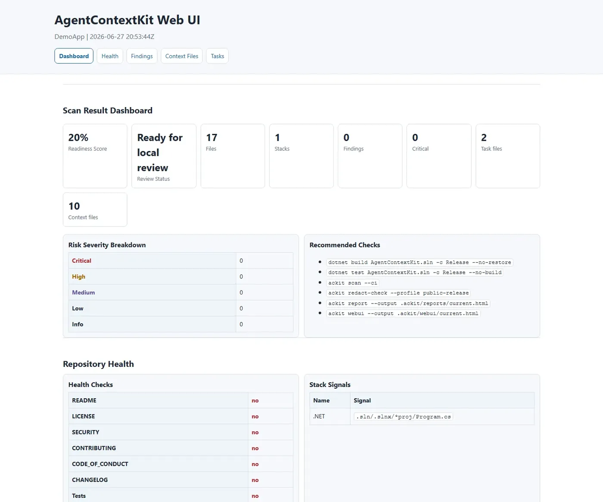

<div align="center">

# AgentContextKit

**AI destekli geliştirme için çevrimdışı-öncelikli repository bağlamı ve güvenlik aracı.**

Repository’nizi analiz edin, temiz agent bağlam dosyaları üretin, task-first çalışma kayıtları oluşturun ve proje AI araçlarıyla paylaşılmadan ya da herkese açılmadan önce secret/PII/marka sızıntısı risklerini yakalayın.

<p>
  <a href="https://github.com/Cynrath/agent-context-kit/actions/workflows/ci.yml"></a>
  <a href="https://github.com/Cynrath/agent-context-kit/actions/workflows/cross-platform-smoke.yml"></a>
  <a href="https://github.com/Cynrath/agent-context-kit/actions/workflows/cross-platform-source-smoke.yml"></a>
</p>

<p>
  <a href="https://www.nuget.org/packages/AgentContextKit"></a>
  <a href="https://www.nuget.org/packages/AgentContextKit"></a>
  <a href="LICENSE"></a>
  <a href="https://dotnet.microsoft.com/"></a>
</p>

<p>
  <a href="README.md"><strong>English</strong></a> ·
  <a href="#hızlı-başlangıç"><strong>Hızlı Başlangıç</strong></a> ·
  <a href="#neler-yapar"><strong>Özellikler</strong></a> ·
  <a href="#cli-komut-haritası"><strong>CLI</strong></a> ·
  <a href="#güvenlik-modeli"><strong>Güvenlik</strong></a> ·
  <a href="#dokümantasyon-haritası"><strong>Dokümanlar</strong></a>
</p>

</div>

Varsayılan komutlar repository içeriğini yerelde işler; repository yüklemez, AI API çağrısı veya telemetri yapmaz ve harici araç çalıştırmaz. Ayrıntılar için [Varsayılan No-Network Politikası](docs/NO_NETWORK_DEFAULT_POLICY.md) belgesine bakın.

> [!IMPORTANT]
> `v1.0.0-rc.1`, GitHub ve NuGet üzerindeki en güncel eksiksiz ön sürümdür. Tam paket asset’leri, iki attestation ve Windows, Ubuntu, macOS kurulu-paket smoke doğrulamaları tamamlanmıştır. Bu bir release candidate’dır; `1.0.0` GA iddiası değildir.

---

## Proje Durumu

| Alan | Durum |
| --- | --- |
| Güncel eksiksiz ön sürüm | `v1.0.0-rc.1`; GitHub ve NuGet üzerinde yayımlandı, tam asset’ler, iki attestation ve üç platformlu kurulu-paket smoke doğrulandı |
| Yayın kanıtı | NuGet repository commit’i ve tam etiket hedefi `258918b33c3d1359aac967604ee524e8b66ddf02`; GitHub ön sürümü [v1.0.0-rc.1](https://github.com/Cynrath/agent-context-kit/releases/tag/v1.0.0-rc.1) |
| Önceki eksiksiz ön sürüm | `v0.2.0-alpha.4` |
| Çalışma zamanı | .NET 10 |
| Platformlar | GitHub Actions ile Windows, Ubuntu ve macOS |
| Gizlilik modeli | Offline-first; MVP repository yüklemez ve uzak AI API çağrısı yapmaz |
| SARIF | `ackit sarif`, yayımlanmış `1.0.0-rc.1` paketinde bulunur |

---

## Önizleme

Web UI; readiness puanı, stack sinyalleri, repository sağlık kontrolleri, bulgular, üretilen bağlam dosyaları ve task önizlemelerini tek bir çevrimdışı panelde gösterir.


*Sentetik bir demo repository’sinden sanitize edilmiş önizleme; yerel yol, secret veya özel veri içermez.*


Bkz. [Web UI Preview](docs/WEB_UI_PREVIEW.md), [Visual Assets](docs/VISUAL_ASSETS.md), [Sample Gallery](docs/SAMPLE_GALLERY.md) ve [Demo Scenarios](docs/DEMO_SCENARIOS.md).

---

## Neden AgentContextKit?

AI coding agent’ları güçlüdür; ancak eksik, eski veya güvensiz bağlam aldıklarında yanlış dosyaları değiştirebilir, test ve yetki beklentilerini kaçırabilir veya özel repository verilerinin istemeden paylaşılmasına yol açabilir. AgentContextKit, repository Codex, Claude Code, Cursor, GitHub Copilot, Gemini CLI veya benzeri bir araca teslim edilmeden önce tekrarlanabilir bir yerel hazırlık akışı sunar.

| Sorun | AgentContextKit’in yaklaşımı |
| --- | --- |
| Agent bağlamı dağınık | Tutarlı agent talimatları ve workflow dosyaları üretir |
| Repository yapısı belirsiz | Kısa proje haritası ve stack sinyali özeti çıkarır |
| İş task kaydı olmadan başlıyor | `docs/tasks/` altında yapılandırılmış task oluşturur |
| Public release sızıntı riski taşıyor | Secret, PII, marka ve yerel yol bulgularını raporlar |
| CI makine-okunur kontrole ihtiyaç duyuyor | JSON çıktı ve `scan --ci` severity kapıları sunar |
| İnceleme çıktıları yerelde kalmalı | Offline HTML, Web UI, prompt pack ve context export üretir |

### Amacınıza göre başlayın

| Amaç | İlk komutlar |
| --- | --- |
| Repository AI destekli çalışmaya hazır mı? | `ackit doctor`, ardından `ackit scan --ci` |
| Agent talimat kalitesini ve bağlam maliyetini denetlemek | Güncel kaynak kod: `ackit optimize` |
| Proje için agent talimatları üretmek | `ackit generate --target all` |
| İzlenebilir bir geliştirme işi başlatmak | `ackit task "Odaklı değişikliği açıklayın"` |
| Bulguları sunucusuz görsel incelemek | `ackit report` veya `ackit webui` |
| Veri yüklemeden bağlam hazırlamak | `ackit prompt-pack`, insan incelemesi, ardından `ackit context-export --approve` |

---

## Neler Yapar?

| Yetenek | Komut | Çıktı |
| --- | --- | --- |
| Yapılandırmayı başlat | `ackit init` | `.ackit/config.yml` |
| Yapılandırmayı doğrula | `ackit config-check` | Salt-okunur sanitize tanı ve geçiş rehberi |
| Repository’yi tara | `ackit scan` | Stack, doküman, test, CI, Docker, agent ve riskli yol sinyalleri |
| Tarama kapsamını filtrele | `ackit scan --include <glob> --exclude <glob>` | Ad-hoc include/exclude filtreleri |
| Riskte CI’ı durdur | `ackit scan --ci` | High veya Critical bulguda sıfırdan farklı çıkış |
| Agent talimatlarını denetle | `ackit optimize` | RC1 sonrası güncel kaynak kodda kapsam, çelişki, kalite ve bağlam maliyeti bulguları; kaynak dosya yeniden yazılmaz |
| İncelenmiş bulguları kaydet | `ackit baseline` | Yeni bulgu politikasına uygun yerel sanitize baseline |
| SARIF üret | `ackit sarif` | Gizlilik-öncelikli SARIF 2.1.0 raporu |
| HTML rapor oluştur | `ackit report` | Çevrimdışı statik tarama raporu |
| Web UI oluştur | `ackit webui` | Çevrimdışı statik inceleme arayüzü |
| Prompt pack hazırla | `ackit prompt-pack` | Uzak çağrı yapmayan yerel dry-run Markdown |
| Onaylı context manifesti çıkar | `ackit context-export` | Yerel onay manifesti |
| Agent dosyaları üret | `ackit generate` | Codex, Claude, Cursor, Copilot ve diğer hedefler |
| Task kaydı oluştur | `ackit task` | Yapılandırılmış Markdown task dosyası |
| Hassas içerik kontrolü yap | `ackit redact-check` | Secret/PII/marka/yerel yol risk raporu |
| Repository sağlığını denetle | `ackit doctor` | OSS ve repository hijyen tanıları |
| Yerel MCP taşımasını çalıştır | `ackit mcp --stdio-server` | Yerel JSON-RPC stdio döngüsü |
| Baseline karşılaştır | `ackit diff` | Sanitize baseline farkı |
| Bağlam çıktısını sınırla | `ackit trim` | Boyut sınırına göre Markdown/JSON kırpma |
| Yerel değişiklikleri izle | `ackit watch` | Debounced yerel tarama izleyicisi |

---

## Hızlı Başlangıç

### NuGet’ten kurulum

```powershell
dotnet tool install --global AgentContextKit --version 1.0.0-rc.1
ackit version
ackit --help
```

İncelemek istediğiniz repository’nin kök dizininde çalıştırın:

```powershell
ackit doctor
ackit scan
ackit scan --ci
```

`scan --ci`, High veya Critical bulguda sıfırdan farklı çıkış kodu döndürür. Yalnız rapor almak istiyorsanız önce `ackit scan` kullanın.

### Yaygın yerel akışlar

```powershell
# Agent talimatları ve task-first kayıt
ackit init --lang tr
ackit generate --target all --lang tr
ackit task "Yetki kontrollerini ekle" --lang tr

# Yerel inceleme çıktıları
ackit sarif --output .ackit/reports/ackit.sarif
ackit report --output .ackit/reports/scan-report.html
ackit webui --output .ackit/webui/index.html

# İncelenmiş baseline
ackit baseline
ackit scan --baseline .ackit-baseline.json --ci
```

`.ackit/` altındaki rapor, Web UI, prompt pack ve context export dosyaları yerel generated artifact’lardır; paylaşmadan önce insan incelemesinden geçirilmelidir.

### Kaynak koddan çalıştırma

```powershell
dotnet restore AgentContextKit.sln
dotnet build AgentContextKit.sln -c Release --no-restore
dotnet test AgentContextKit.sln -c Release --no-build
dotnet run --project src/AgentContextKit.Cli/AgentContextKit.Cli.csproj -c Release --no-build -- --help
dotnet run --project src/AgentContextKit.Cli/AgentContextKit.Cli.csproj -c Release --no-build -- scan --ci
dotnet run --project src/AgentContextKit.Cli/AgentContextKit.Cli.csproj -c Release --no-build -- sarif --output .ackit/reports/ackit.sarif
dotnet run --project src/AgentContextKit.Cli/AgentContextKit.Cli.csproj -c Release --no-build -- optimize --json
dotnet run --project src/AgentContextKit.Cli/AgentContextKit.Cli.csproj -c Release --no-build -- optimize --proposal .ackit/reports/optimized-instructions.md
```

Yayımlanmış `1.0.0-rc.1` paketi ACKit Optimize’dan önce gelir. Build Week komutu şu anda kaynak koddan gösterilir; RC1 paketi, etiketi, GitHub Release’i, asset’leri veya attestation kayıtları geriye dönük değiştirilmemiştir. `--proposal`, açıkça verilen depo-köküne-göreli bir Markdown yolu ister, var olan çıktıyı atlar, yönerge kaynaklarını hedeflemez ve apply modu içermez.

### Örnek üzerinde deneyin

```powershell
Push-Location samples/dotnet-console
dotnet run --project ../../src/AgentContextKit.Cli/AgentContextKit.Cli.csproj -c Release --no-build -- scan --ci
Pop-Location

Push-Location samples/ackit-optimize-demo
dotnet run --project ../../src/AgentContextKit.Cli/AgentContextKit.Cli.csproj -c Release --no-build -- optimize --json --proposal .ackit/reports/optimized-instructions.md
Pop-Location
```

İlk kullanım için [First Five Minutes With Ackit](docs/FIRST_FIVE_MINUTES.md), gerçek bir projeye uyarlamak için [Prepare A Repository For AI Coding Agents](docs/PREPARE_REPOSITORY_FOR_AI_AGENTS.md) rehberini izleyin.

---

## CLI Komut Haritası

Bu harita değiştirilemez yayımlanmış `1.0.0-rc.1` temelini [CLI Contract](docs/CLI_CONTRACT.md) ve [CLI Reference](docs/CLI_REFERENCE.md) içindeki güncel kaynak kod ekleriyle birlikte gösterir. `ackit optimize`, RC1 sonrası eklenmiştir ve yayımlanmış pakette yoktur.

```text
ackit init [--lang en|tr] [--json]
ackit config-check [--lang en|tr] [--json]
ackit scan [--baseline <repo-relative.json>] [--include <glob>] [--exclude <glob>] [--lang en|tr] [--json] [--ci]
ackit optimize [--format console|json|markdown|sarif|html] [--output <repo-relative-file>] [--include <glob>] [--exclude <glob>] [--lang en|tr] [--json] [--ci]
ackit baseline [--output <repo-relative.json>] [--update] [--lang en|tr] [--json]
ackit sarif --output <repo-relative.sarif> [--baseline <repo-relative.json>] [--lang en|tr] [--json]
ackit report [--output <repo-relative.html>] [--baseline <repo-relative.json>] [--lang en|tr] [--json]
ackit webui [--output <repo-relative.html>] [--baseline <repo-relative.json>] [--lang en|tr] [--json]
ackit prompt-pack [--output <repo-relative.md>] [--lang en|tr] [--json]
ackit context-export --prompt-pack <repo-relative.md> --approve [--output <repo-relative.json>] [--lang en|tr] [--json]
ackit generate [--target codex|claude|anthropic|cursor|copilot|continue|all] [--lang en|tr] [--json]
ackit task "<başlık>" [--lang en|tr] [--json]
ackit redact-check [--profile public-release] [--lang en|tr] [--json]
ackit doctor [--lang en|tr] [--json]
ackit hooks [--target codex|claude|anthropic|continue] [--shell pwsh|sh] [--install|--dry-run] [--output <repo-relative-dir>] [--lang en|tr] [--json]
ackit mcp --stdio-server [--repo <path>] [--lang en|tr]
ackit mcp --stdio <json-request> [--output <repo-relative.jsonl>] [--lang en|tr]
ackit diff --from <from.json> --to <to.json> [--lang en|tr] [--json]
ackit trim --input <repo-relative.md|json> --output <repo-relative.md|json> --max-chars <N> [--lang en|tr] [--json]
ackit watch [--debounce-ms <N>] [--once] [--max-runtime-ms <N>] [--json] [--lang en|tr]
ackit version
ackit --help
```

## Üretilen Dosyalar

| Alan | Dosyalar |
| --- | --- |
| Agent talimatları | `AGENTS.md`, `CLAUDE.md`, `.cursor/rules/project.mdc`, `.github/copilot-instructions.md` |
| Proje akışı | `docs/PROJECT_MAP.md`, `docs/AI_WORKFLOW.md`, `docs/SECURITY_NOTES.md`, `docs/DEVELOPMENT_STANDARD.md` |
| Task takibi | `docs/tasks/TASK-0001.md` |
| Codex handoff | `.codex/HANDOFF.md`, `.codex/CONTEXT_PACK.md` |
| Raporlar | `.ackit/reports/scan-report.html`, `.ackit/reports/ackit.sarif` |
| İnceleme UI | `.ackit/webui/index.html` |
| Prompt incelemesi | `.ackit/prompt-packs/prompt-pack.md` |
| Context onayı | `.ackit/context-exports/context-export-manifest.json` |

---

## Güvenlik Modeli

| Davranış | Varsayılan |
| --- | --- |
| Uzak AI/API çağrısı | MVP’de yok |
| Repository yükleme | Yok |
| Mevcut generated dosyalar | Varsayılan olarak atlanır |
| Otomatik secret redaction | MVP’de yok |
| Risk seviyeleri | Critical, High, Medium, Low, Info |
| SARIF içeriği | Repository-relative konumlar; ham secret eşleşmesi yazılmaz |
| Prompt pack | Yalnız yerel dry-run artifact |
| Context export | Yalnız yerel onay manifesti |
| Yayınlama | Araç GitHub push veya NuGet publish yapmaz |

> [!CAUTION]
> Statik raporlar, Web UI, prompt pack ve context export manifestleri repository metadatası veya yerel yol içerebilir. Paylaşmadan önce mutlaka inceleyin.

Scanner, yaygın platform/package domainleri ve açıkça sentetik fixture değerleri için dar bir allowlist kullanır. Yapılandırılmış allowlist’ler non-Critical gürültüyü bastırabilir; Critical bulgular raporlanmaya devam eder.

---

## Lokalizasyon

Varsayılan dil İngilizcedir. Türkçe için desteklenen komutlarda `--lang tr` kullanın. Bilinmeyen dil değeri İngilizceye düşer. İnsan-okunur çıktı UTF‑8 Türkçe karakterler kullanabilir; JSON alan adları ve schema değerleri İngilizce ve kararlı kalır.

```powershell
ackit init --lang tr
ackit scan --lang tr
ackit generate --target all --lang tr
ackit task "Yetki kontrollerini ekle" --lang tr
```

---

## Dokümantasyon Haritası

Başlangıç noktası: [Dokümantasyon İndeksi](docs/DOCUMENTATION_INDEX.md).

| Kategori | Bağlantılar |
| --- | --- |
| Kullanım | [CLI Reference](docs/CLI_REFERENCE.md), [Examples](docs/EXAMPLES.md), [Example Workflows](docs/EXAMPLE_WORKFLOWS.md) |
| Demo | [Sample Gallery](docs/SAMPLE_GALLERY.md), [Demo Scenarios](docs/DEMO_SCENARIOS.md), [Web UI Preview](docs/WEB_UI_PREVIEW.md) |
| Raporlar | [HTML Reports](docs/HTML_REPORTS.md), [SARIF Output](docs/SARIF_OUTPUT.md), [Web UI Prototype](docs/WEB_UI_PROTOTYPE.md) |
| Operasyon | [Configuration](docs/CONFIGURATION.md), [JSON Output](docs/JSON_OUTPUT.md), [Troubleshooting](docs/TROUBLESHOOTING.md) |
| Mühendislik | [Architecture](docs/ARCHITECTURE.md), [Source Hygiene](docs/SOURCE_HYGIENE.md), [Security Model](docs/SECURITY_MODEL.md) |
| Paketleme | [Packaging](docs/PACKAGING.md), [Release Validation](docs/RELEASE_VALIDATION.md), [Maintainer Release Handoff](docs/MAINTAINER_RELEASE_HANDOFF.md) |
| Katkı | [Contributor Onboarding](docs/CONTRIBUTOR_ONBOARDING.md), [Support Matrix](docs/SUPPORT_MATRIX.md), [Maintainer Guide](docs/MAINTAINER_GUIDE.md) |

## Ekosistem

AgentContextKit repository’yi AI coding agent’a veya release kararına ulaşmadan önce hazırlar. Repo-to-context paketleyicileri, graph/search araçları, güvenlik scanner’ları ve SBOM araçları bu akışı tamamlayabilir; ancak harici çıktıların paylaşımı her zaman ayrı insan ve gizlilik incelemesi gerektirir.

Bkz. [Related Projects](docs/RELATED_PROJECTS.md), [Comparison Matrix](docs/RELATED_TOOLS_COMPARISON_MATRIX.md), [External Workflows](docs/EXTERNAL_TOOL_WORKFLOWS.md) ve [Agent Context Pipeline](docs/AGENT_CONTEXT_PIPELINE.md).

## Paketleme ve Platform Desteği

Yerel paket doğrulama [Packaging](docs/PACKAGING.md) ve [Release Validation](docs/RELEASE_VALIDATION.md) belgelerinde açıklanır. Güncel eksiksiz ön sürüm `1.0.0-rc.1` bir NuGet global tool’dur. Yayımlanmış paket ve güncel kaynak akışları Windows, Ubuntu ve macOS üzerinde ayrı GitHub Actions smoke workflow’larıyla izlenir.

## Katkı, Güvenlik ve Lisans

- Katkı: [CONTRIBUTING.md](CONTRIBUTING.md) ve [Contributor Onboarding](docs/CONTRIBUTOR_ONBOARDING.md)
- Güvenlik bildirimi: [SECURITY.md](SECURITY.md). Public issue’larda secret, özel repository içeriği veya production configuration paylaşmayın.
- Roadmap: [docs/ROADMAP.md](docs/ROADMAP.md)
- Lisans: [MIT](LICENSE)
