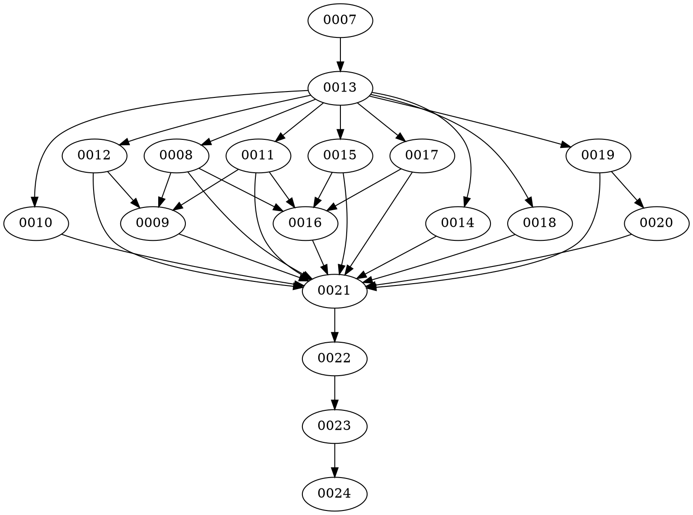

# AgentContextKit v0.2.0 — Execution Plan

Canonical dependency-aware execution order for the **single consolidated v0.2.0 release**. Every row is `release: v0.2.0`; there is no v0.3/v0.4 split. The next coding-agent prompt must follow this order without asking what to do next; pick the first runnable task (all dependencies completed, lowest phase, then lowest TASK-ID among runnable).

## Dependency flow (actual allocated IDs)

```
requirements + ADRs (TASK-0007)
        ↓
shared engine contracts / SDK boundaries (TASK-0013)
        ↓
score (0008) + graph v2 (0011) + profiles (0010) + rule-packs (0012)   [parallel, all need SDK]
        ↓
optimize v2 (0009)  [depends on 0008,0011,0012 — reads via SDK]
        ↓
GitHub Action (0014) + watch engine (0015) + diagnostics (0017) + benchmarks (0018)  [parallel, need SDK]
        ↓
dashboard (0016)  [needs 0008,0011,0015,0017]
        ↓
VS Code foundation (0019) → VS Code features (0020)   [sequential, need SDK]
        ↓
security hardening gate (0021)  [reviews all new surfaces: 0008,0009,0010,0011,0012,0014,0015,0016,0017,0018,0019,0020]
        ↓
docs / examples / migration (0022)  [needs 0021]
        ↓
full integration & consumer matrix (0023)  [needs 0022]
        ↓
release readiness & evidence (0024)   [FINAL — no publish without authorization, needs 0023]
```

No circular dependencies. Validated by topological sort (`scripts/check-execution-order.mjs` — simple Kahn check over `docs/tasks/active/*.md` `dependencies[]`). Even though some numeric IDs appear out of wave order (SDK is 0013 but readiness is 0008), the dependency edges are acyclic because waves increase strictly.

## Phases & waves (actual)

| Phase | Title | Parallelism | Task IDs (actual) | Notes |
|---|---|---|---|---|
| 0 | Baseline & planning artifact freeze | no | 0007 | Single-task gate; re-confirms ADRs + dep pins |
| 1 | Shared contracts (SDK) | no | 0013 | SDK freeze blocks all engine reuse |
| 2 | Core engines (score, graph, profiles, packs) | yes (4 tasks) | 0008, 0011, 0010, 0012 | Disjoint file sets: `src/core/readiness`, `graph`, `profiles`, `policy/packs` |
| 3 | Optimize (composition) | no | 0009 | Consumes score+graph+packs via SDK |
| 4 | Integration surfaces (action, watch, diagnostics, bench) | yes (4 tasks) | 0014, 0015, 0017, 0018 | Each touches separate command/capability |
| 5 | Dashboard | no | 0016 | Requires watch + readiness + graph + diagnostics |
| 6 | VS Code (foundation → features) | sequential | 0019 → 0020 | Foundation owns `extensions/vscode` scaffold + vsix audit |
| 7 | Security hardening | no | 0021 | Gate reviewing T16–T20 across all above |
| 8 | Docs & examples | no | 0022 | Uses finalized behavior |
| 9 | Integration matrix | no | 0023 | Full consumer battery |
| 10 | Release readiness | no | 0024 | Tag-triggered publish guard |

## Task table — canonical schedule (actual allocated IDs)

Columns: TASK-ID, title, epic, dependencies, parallelizable, critical-path, affected subsystems, primary gates, artifacts, release.

> Critical-path = yes means a delay there delays the release; non-critical allows slack. All paths eventually converge on TASK-0024.

| TASK-ID | Title | Epic | Dependencies | Parallelizable | Critical Path | Affected Subsystems | Primary Gates | Artifacts | Release |
|---|---|---|---|---|---|---|---|---|---|
| TASK-0007 | v0.2.0 requirements + architecture baseline | — (meta) | [] | no | yes | docs/v0.2.0, ADRs 0015–0024, `ackit.yml` schemaVersion bump prep | task doctor, docs-review, `pnpm build` of docs tool | `REQUIREMENTS.md`, `TRACEABILITY.md`, ADRs, ROADMAP, EXECUTION_PLAN, DOD | v0.2.0 |
| TASK-0013 | Public SDK v1 stabilization (shared contracts) | J | [0007] | no | yes | `src/index.ts`, `src/api/*`, `package.json` exports, `src/shared/*` | contract: api-surface snapshot, integration: AbortSignal, e2e: isolated consumer tarball install | `src/index.ts` (frozen surface), `tests/contract/api-surface/*`, `docs/reference/sdk.md` | v0.2.0 |
| TASK-0008 | Readiness / context-quality scoring engine | A | [0013] | yes | yes | `src/core/readiness/*`, `src/core/config` (weights), CLI `scan`/`doctor`, `schemas/readiness.schema.json` | unit: golden fixture score, contract: `ackit.readiness.v1`, integration: CI `--fail-below` gate, security: redaction spy | engine + schema + `docs/concepts/readiness.md` | v0.2.0 |
| TASK-0011 | Instruction graph v2 | D | [0013] | yes | yes | `src/core/instructions/graph.ts`, `types.ts`, `analysis/*`, `schemas/instruction-graph.schema.json` v2 | unit: scope/conflict/shadow/dead fixtures, integration: symlink+monorepo+limits, contract: graph v2 schema | graph v2 engine + fixtures | v0.2.0 |
| TASK-0010 | Provider-aware context profiles | C | [0013] | yes | no | `src/core/profiles/*`, `templates/profiles/`, `schemas/profile.schema.json`, `src/core/context/pack.ts` | unit: selection precedence, integration: `pack --profile` delta, contract: profile schema | 5 built-in YAMLs + schema + `docs/concepts/provider-profiles.md` | v0.2.0 |
| TASK-0012 | Declarative rule packs / policy packs | E | [0013] | yes | yes | `src/core/policy/packs/*`, `schemas/rule-pack.schema.json`, `src/core/scanner/orchestrate.ts` | unit: pack validation, integration: 2-pack collision, security: ReDoS/size limits | pack modules + docs `docs/guides/rule-packs.md` | v0.2.0 |
| TASK-0009 | `ackit optimize` v2: explain + fix plan | B | [0008, 0011, 0012] | no | yes | `src/core/context/optimize.ts` v2, `src/cli/commands/optimize.ts`, reporting | unit: fixture per finding class, integration: `--explain --json` provenance, cli-smoke: filter flags | optimize v2 engine | v0.2.0 |
| TASK-0014 | Official GitHub Action | F | [0013] | yes | no | `action.yml`, `action/src/*` (`dist/action/index.js`), `.github/workflows/ackit-action-dogfood.yml` | ci-config: actionlint, integration: `uses: ./` smoke + annotations, contract: action.yml shape | action bundle + dogfood workflow | v0.2.0 |
| TASK-0015 | Watch + incremental live engine | G (watch) | [0013] | yes | no | `src/core/watch/watch.ts` (extend), `src/core/cache/*`, `src/cli/commands/scan.ts` (`--watch`) | unit: debounce coalescing, integration: ignored-dirs + graceful shutdown | watch engine | v0.2.0 |
| TASK-0017 | Diagnostics / observability | H | [0013] | yes | no | `src/cli/commands/diagnostics.ts` (new), `src/core/diagnostics/*`, schemas `diagnostics.schema.json` | security: bundle redaction proof (5 secrets), integration: `--json` schema | diagnostics cmd + bundle logic | v0.2.0 |
| TASK-0018 | Performance benchmark system | I | [0013] | yes | no | `benchmarks/*` (fixtures, `run.mjs`, `check-thresholds.mjs`, `thresholds.json`, `baselines/`) | integration: fixture determinism, contract: results schema, perf: multiplier gate | bench suite + baselines | v0.2.0 |
| TASK-0016 | Local dashboard / report server | G (dashboard) | [0008, 0011, 0015, 0017] | no | yes | `src/core/dashboard/*`, `src/dashboard/ui/*`, `src/core/reporting/serve.ts` | integration: localhost-only bind + port 0, e2e: watch→live update, security: headers/XSS/secret redaction, perf: large-repo | dashboard server + vanilla UI | v0.2.0 |
| TASK-0019 | VS Code extension — foundation & packaging | K (found) | [0013] | no | yes | `extensions/vscode/{package.json,src/extension.ts,src/providers/**}`, `vsce` build | contract: manifest whitelist + version alignment, unit: vscode activation tests | `extensions/vscode/` scaffold + VSIX | v0.2.0 |
| TASK-0020 | VS Code extension — feature integration | K (feat) | [0019] | no | yes | same `extensions/vscode/`, SDK consumption (`scanRepository`, `resolveEffectiveStack`, `scoreRepository`) | integration: Problems diagnostics, current-file stack view, command palette | feature providers + tree views | v0.2.0 |
| TASK-0021 | Cross-cutting security hardening | L | [0008, 0009, 0010, 0011, 0012, 0014, 0015, 0016, 0017, 0018, 0019, 0020] | no | yes | `docs/security/THREAT_MODEL.md` delta, `src/**` (headers, redaction), `scripts/check-security-boundaries.mjs` | security: per-surface fixtures (dashboard XSS, pack traversal, action injection, diagnostics redaction), grep gate, ci matrix | threat model delta + gate script | v0.2.0 |
| TASK-0022 | Documentation / examples / migration | M | [0021] | no | yes | `README.md`, `docs/guides/*`, `docs/reference/*`, `docs/architecture/overview.md`, `examples/**`, `CHANGELOG.md` | docs-review: guide→fixture scan, dead-link gate, integration: `ackit scan --ci` on each example | docs tree + examples + CHANGELOG 0.2.0 entry | v0.2.0 |
| TASK-0023 | Full integration & consumer test matrix | — | [0022] | no | yes | `tests/integration/**`, `tests/e2e/**`, `scripts/package-smoke.mjs`, `extensions/vscode` test | e2e: tarball install, SDK consumer, MCP consumer, Action consumer, dashboard smoke, diagnostics smoke, pack/profile/bench/vsix smoke, ci: full matrix | matrix log artifact `artifacts/v020-matrix.log` | v0.2.0 |
| TASK-0024 | v0.2.0 integration & release readiness | N | [0023] | no | yes | `.github/workflows/release.yml`, `package.json` (0.2.0), `extensions/vscode/package.json` (mirror), docs/release notes | e2e: exact-SHA CI 10/10 green, audits (tarball, VSIX, actionlint), registry absent proof, explicit user authorization checkpoint | GitHub Release + provenance, VSIX audit + optional marketplace attachment | v0.2.0 |

## Deterministic next-task selection rule (binding for implementation)

Pick the first task satisfying:
1. `status !== completed`
2. every `dependencies[]` task is `completed`
3. lowest phase number (as per Phases table above)
4. within same phase: lowest TASK-ID (numeric)

This matches `docs/rebuild/VNEXT_EXECUTION_ORDER.md` rule and prevents ambiguity. Even though SDK is 0013 > 0008 numerically, phase ordering (1 < 2) ensures SDK runs before readiness.

## Cycle proof

Dependency edges point strictly from lower-or-equal phase to strictly greater phase, except the parallel groups (phase 2 and phase 4) whose members have no edges among themselves. A cycle would require an edge back to a lower phase — absent by construction. Validated by Kahn topological sort over the file-system `docs/tasks/active/*.md` dependency lists before implementation starts.

## Suggested high-level dependency digraph (DOT, for docs — actual IDs)



## Affected subsystems lookup (per task sets to reviewer context)

- Filesystem: `src/core/filesystem/*`
- Scanner/rules: `src/core/scanner/*`, `src/core/context/pack.ts` (secret gate), `src/core/policy/packs/*`
- Instructions/graph: `src/core/instructions/*` + `src/core/profiles/*`
- Context/pack: `src/core/context/*`
- Tasks/policy: `src/core/tasks/*`, `src/core/policy/*`
- Reporting/dashboard: `src/core/reporting/*`, `src/dashboard/ui/*`
- Watch: `src/core/watch/*`
- SDK: `src/index.ts`, `src/api/*`
- CLI: `src/cli/*`
- MCP: `src/mcp/*` (reuse surface, no new MCP work except SDK wiring check)
- VS Code: `extensions/vscode/*`
- Action: `action/*`
- Benchmarks: `benchmarks/*`
- Docs: `docs/**`, `examples/**`

## Release target

All tasks: `release: v0.2.0`. Any task file whose frontmatter or body references a different target release is a hard violation — checked by `scripts/check-v020-traceability.mjs`.

## Validation before start

```powershell
pnpm install --frozen-lockfile
pnpm build
node dist/cli/index.js task doctor
node dist/cli/index.js config check
node dist/cli/index.js doctor
node dist/cli/index.js skills validate
node dist/cli/index.js instructions
node dist/cli/index.js scan --ci
git diff --check
node scripts/check-execution-order.mjs   # pending creation — simple Kahn check
node scripts/check-v020-traceability.mjs # pending creation — REQ↔task ↔ ADR ↔ docs cross-check
```

Next step for the executor: follow this order; after each task is completed, commit with `docs(v0.2.0): ...` and start the next dependency-ready task.
